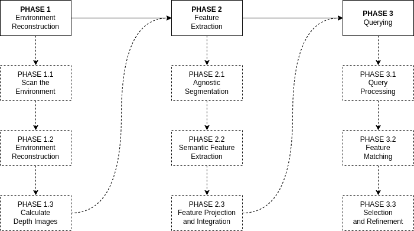
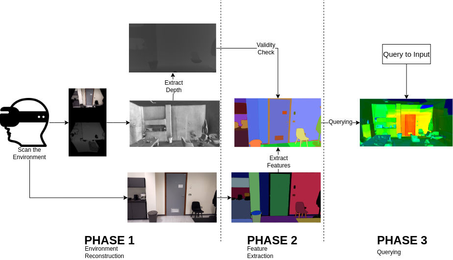

# Paolo Fasano - Master thesis

<b>Abstract:</b> Understanding and interacting with complex 3D environments is increasingly important in robotics, virtual reality, and autonomous systems. To address this need, this thesis project aims to develop a system that reconstructs a 3D model of the environment enhanced with semantic features. We project in the 3D model the semantic features extracted using pre-trained 2D foundational models, such as Segment Anything and OpenCLIP. This allows open-vocabulary queries about the environment in natural language that are not restricted by predefined categories or information and without requiring additional training.
The system is validated on real RGB-D data captured from a HoloLens 2 device.    

<b>System input:</b> 
- The system works feeding it with a 3D environment, in our intnace it was a environment recontructed via the output of a Hololens 2 and the use of Poisson Surface Reconstruction
- The RGB-D data and a file containing the following infromations as follows
                                
        1-st row | the x-coordinate of the principal point, the y-coordinate of the principal point,image width, image height
        2-nd to n-th row | timestamp, focal length along the x-axis, focal length along the y-axis, extrinsics[0,0], extrinsics[0,1], extrinsics[0,2], extrinsics[0,3], extrinsics[1,0], extrinsics[1,1], extrinsics[1,2], extrinsics[1,3], extrinsics[2,0], extrinsics[2,1], extrinsics[2,2], extrinsics[2,3], extrinsics[3,0], extrinsics[3,1], extrinsics[3,2], extrinsics[3,3]
             
<b>System output:</b> 
&ensp; <b>Phase 1:</b> The reconstructed RGB-Depth.  
&ensp; <b>Phase 2:</b> A .bin file that contains the summed and normalized features for each vertex. (The file file is reconstructed so that the vertex id is implicit in the encoding, in other worlds, if you want the feature on the 10-th vertex ypu read and encode the .bin file as a vector of thensors and get the 10-th position in the vector)  
&ensp; <b>Phase 3:</b> A .ply mesh coloured using a color-ramp so that red is the part of the mesh that most answers the query. A .json file with the similarity scores for each vertex. 

## Installation guide
The following section will describe the steps needed to install this repository and run the content. 
To install and than run the system you will need to use Docker.

### Dockerfile installation
If you need to install Docker, follow the official Docker documentation:

**Docker** install Docker following the [instructions here](https://docs.docker.com/get-docker/)

For any errors in the installation of docker and/or the creation/use of a docker image refer to the [official docker docs](https://docs.docker.com/reference/). 

<b>In both docker and .sh files check that the paths are the ones you need and change them if need be</b>

## Run Phase-1: build_depth
To run the depth reconstruction phase, be sure to have the mesh, the RGB-D and the file containing timestamp, intrinsics and extrinsics.

Change the paths to the folders where your data are stored in run_build_depth.sh
Choose if you want to just build the docker or run the whole process via the variables in run_build_depth.sh than run this file.

        bash run_build_depth.sh --build_only true --run_only true --delate_container true
